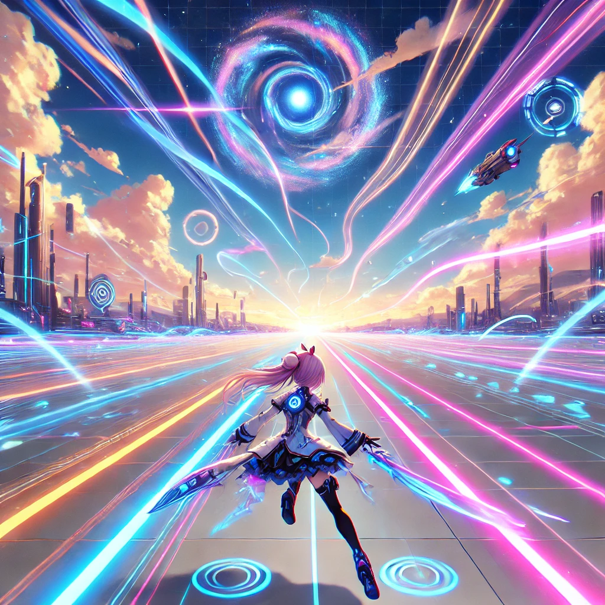
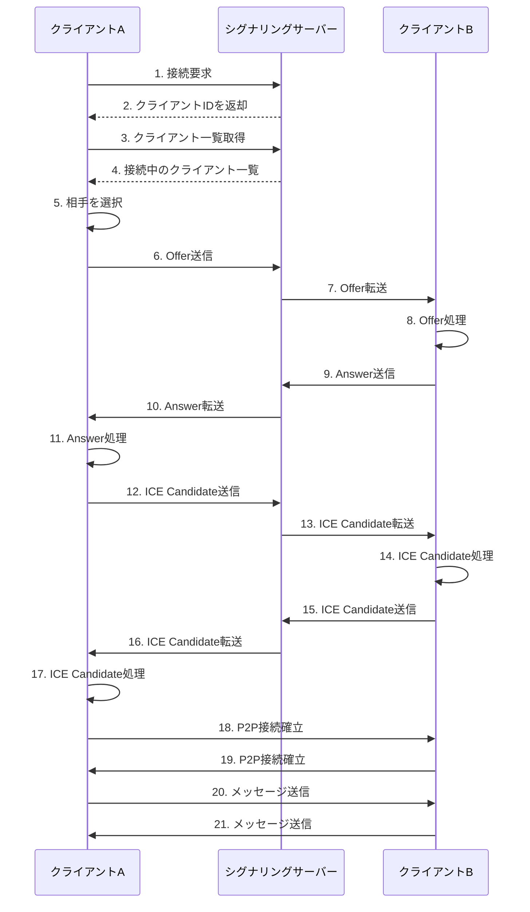

# Lorentz Arena

A multiplayer combat game with special relativity effects.

```mermaid
sequenceDiagram
    participant ClientA as クライアントA
    participant Signaling as シグナリングサーバー
    participant ClientB as クライアントB

    %% 初期接続
    ClientA->>Signaling: 1. 接続要求
    Signaling-->>ClientA: 2. クライアントIDを返却
    ClientA->>Signaling: 3. クライアント一覧取得
    Signaling-->>ClientA: 4. 接続中のクライアント一覧

    %% 接続確立
    ClientA->>ClientA: 5. 相手を選択
    ClientA->>Signaling: 6. Offer送信
    Signaling->>ClientB: 7. Offer転送
    ClientB->>ClientB: 8. Offer処理
    ClientB->>Signaling: 9. Answer送信
    Signaling->>ClientA: 10. Answer転送
    ClientA->>ClientA: 11. Answer処理

    %% ICE Candidate交換
    ClientA->>Signaling: 12. ICE Candidate送信
    Signaling->>ClientB: 13. ICE Candidate転送
    ClientB->>ClientB: 14. ICE Candidate処理
    ClientB->>Signaling: 15. ICE Candidate送信
    Signaling->>ClientA: 16. ICE Candidate転送
    ClientA->>ClientA: 17. ICE Candidate処理

    %% P2P通信確立
    ClientA->>ClientB: 18. P2P接続確立
    ClientB->>ClientA: 19. P2P接続確立

    %% メッセージ送受信
    ClientA->>ClientB: 20. メッセージ送信
    ClientB->>ClientA: 21. メッセージ送信
```
